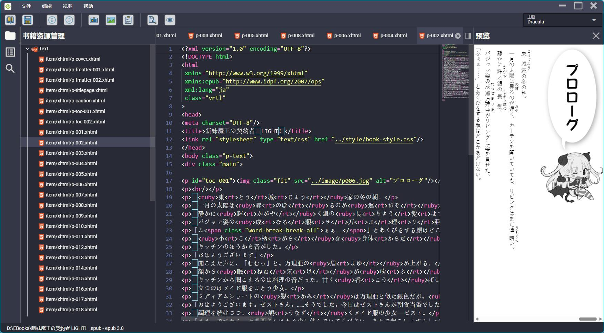
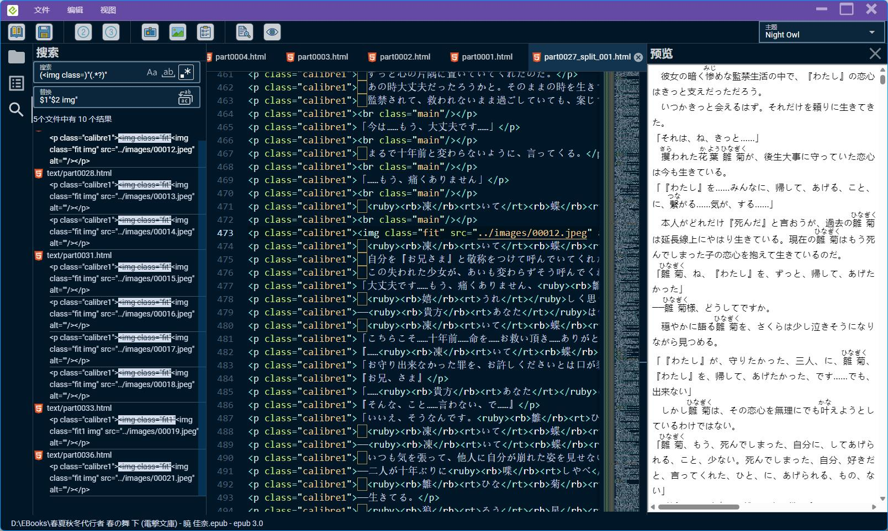
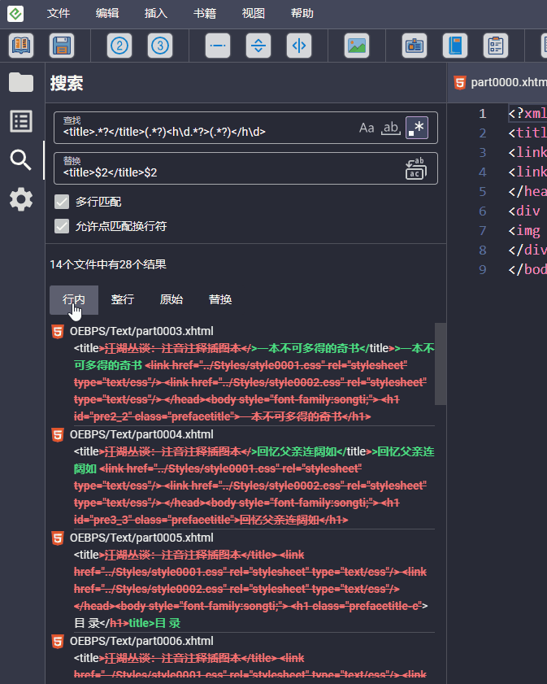
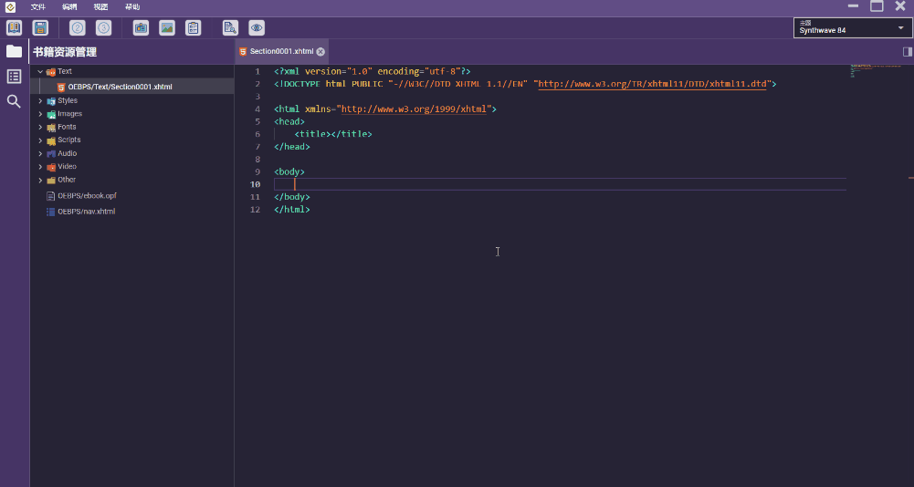

#  Ebook Code

EPUB文档编辑器，目前正在开发中。

# Preview






## Features

* 支持创建ePub2和ePub3。
* 代码高亮、代码提示和补全。
* 实时预览。
* 全书搜索、替换，支持正则搜索、全文字搜索、纯文本搜索。
* 增、删、改以及重命名ePub内的文件。
* 编辑元数据、封面、目录等等。
* 内置几十种界面主题。
* ePub3兼容ePub2。
* 自动检测更新
* 自动发布安装包

## TODO

* 多文件批量处理
* 自动生成目录
* 支持插件
* 字体子集化
* 自定义主题颜色
* 文件分割、合并
* 代码片段

## Run the app

### Install the dependencies

```bash
pnpm install
```

### Start the app in development mode

```bash
pnpm tauri:dev
```

### Lint the files

```bash
pnpm lint
```

### Build the app

```bash
pnpm tauri:build
```

### 关于打包

程序打包需要秘钥，参考 [tauri-plugin-updater](https://v2.tauri.app/plugin/updater)。

生成秘钥命令

```bash
pnpm gen-key
```

或者

```bash
pnpm tauri signer generate -w ./~/.tauri/myapp.key
```

生成秘钥过程中，会要求你输入一个密码，你可以选择输入密码，或者选择留空。

然后创建密码文件~/.tauri/password.key，内容就是输入的那个密码，如果留空了，创建一个空白文件即可。

最后运行`pnpm tauri:build`打包。